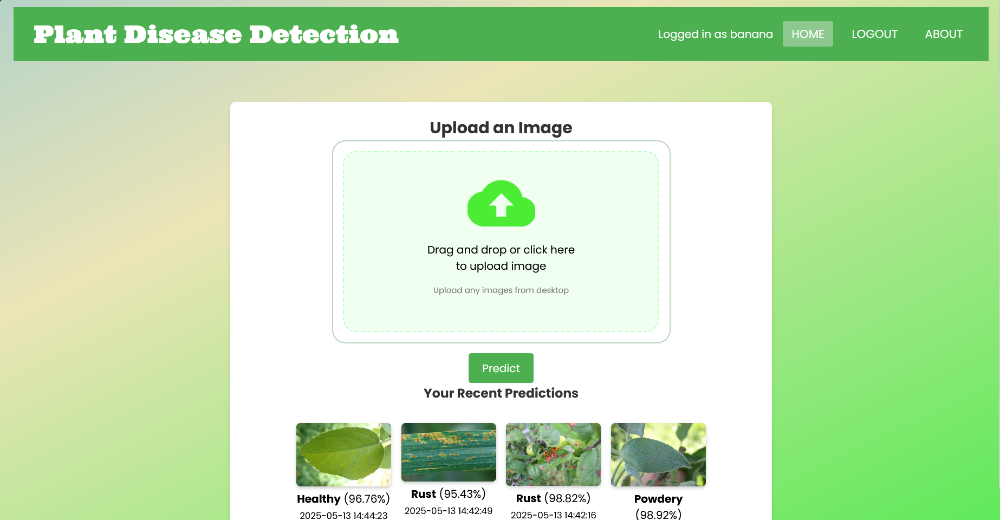
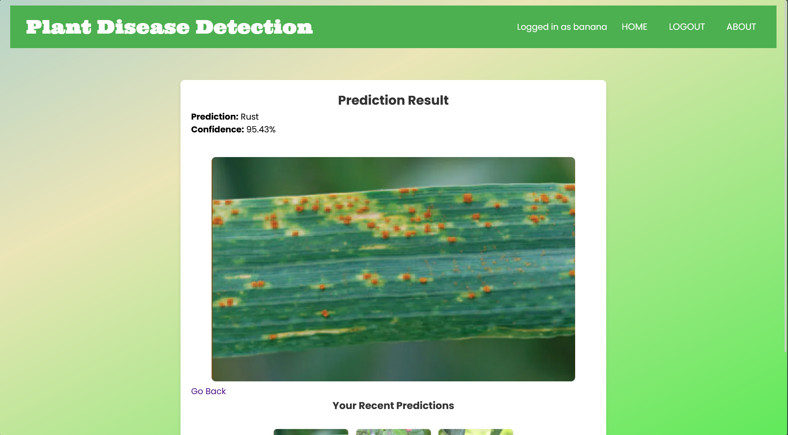
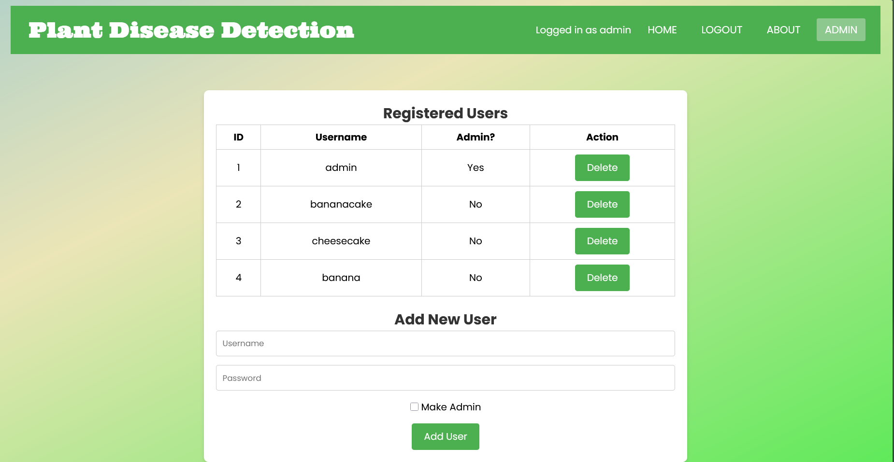

# Plant Disease Detection
   
## Description
- This project presents the development of a web-based application for diagnosing foliar plant diseases using image-based recognition and automated classification. It uses a Convolutional Neural Network (CNN) with MobileNetV2 as its architecture for the classification and identification of common leaf diseases, specifically Healthy, Powdery, and Rust conditions. It also has an admin (default password is admin) for manually adding and deleting users.
- This project was made for learning how to train and test models, as well as how to integrate the back end with the front end for our Machine Learning Elective subject.
- This project uses Flask for the back end, HTML, CSS and JavaScript for the front end, TensorFlow for machine learning, and SQLite for the locally stored database.

## Screenshots








## Requirements
- Python 3.10.6 and above
- Virtual environment (optional, but better to host one)

## Setup
1.) Clone this repository
```bash
https://github.com/adobong-sunog/cpeElecProj-plantRec.git
```
2.) Locate folder then install required libraries
```python
pip install -r requirements.txt
```
3.) Run application
```
flask --app app.py run
```
or 
```
python -m flask run
```
## Project gaps to improve on
- The model is not yet trained to detect all diseases, only 3 types of diseases are detected. The model can be trained to detect more diseases by adding more images to the dataset.
- The model is not perfect, it can misclassify images. The model can be improved by adding more images to the dataset and training it for a longer time.
- This project is not deployed to a cloud service, it is only running locally. The project can be deployed to a cloud service like AWS or Google Cloud for better accessibility.

## Acknowledgements
### Special thanks to [CodeKuen](https://github.com/CodeKuen), who helped with designing and developing most of the front end for this project!
- [Plant disease recognition dataset by Rashik Rahman](https://www.kaggle.com/datasets/rashikrahmanpritom/plant-disease-recognition-dataset), for providing huge amounts of leaf images for training the model.
- [Python for AI #3: How to Train a Machine Learning Model with Python by Assembly AI](https://youtu.be/T1nSZWAksNA?si=qpSaSJYoPL81HXyv) and [Build your first machine learning model in Python by Data Professor](https://youtu.be/29ZQ3TDGgRQ?si=JD6-gKBr8NjZRaPQ), for providing a tutorial on how to build machine learning models with Python
- [Transfer Learning: Image Classification with MobileNet-V2 by WallEve](https://youtu.be/EHkbznaB2rY?si=71FnooDOq3SC2xen), for providing a basis on how to apply transfer learning to our model.